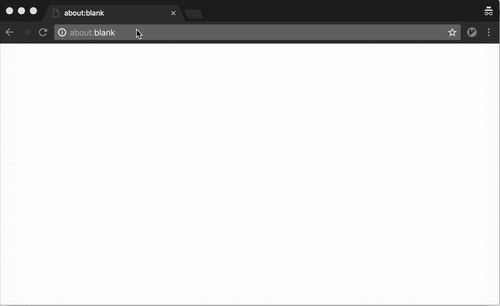

# Next.js auth with Github [](https://greenkeeper.io/) [](https://circleci.com/gh/possibilities/next-github-auth)

Components and decorators for using [Github](https://github.com) authentication with [Next.js](https://github.com/zeit/next.js)



## Usage

1. Install into your Next.js app

    ```
    yarn add next-github-auth
    ```

1. Create `sign-in` and `sign-out` pages

    At `pages/sign-in.js`

    ```
    import { SignIn } from 'next-github-auth' export default SignIn
    ```

    At `pages/sign-out.js`

    ```
    import { SignOut } from 'next-github-auth'
    export default SignOut
    ```

    If you need to customize the scope you can pass configure the `SignIn` page

    ```
    import { configureSignIn } from 'next-github-auth'
    const SignIn({ scope: 'repo gist' })
    export default SignIn
    ```

1. Wrap private pages with `PrivatePage` decorator

    Any Next.js "page" that should only be accessible to authenticated users should be wrapped with the `PrivatePage` decorator, e.g.:

    ```
    import { PrivatePage } from 'next-github-auth'

    const Private = props => <div>private page!</div>
    export default PrivatePage(Private)
    ```

1. Wrap public pages with `PublicPage` decorator

    _All other_ Next.js "pages" should be wrapped with the `PublicPage` decorator, e.g.:

    ```
    import { PublicPage } from 'next-github-auth'

    const Public = props => <div>public page!</div>
    export default PublicPage(Public)
    ```

1. Optionally access the currently signed in github user and access tokens in a Next page component's `getInitialProps`, e.g:

    ```
    import React from 'react'
    import PropTypes from 'prop-types'
    import { PrivatePage } from 'next-github-auth'

    const UserRepos = ({
      github: {
        accessToken,
        user: { login }
      }
    }) => (
      <div>
        {!repos.length && (
          <div>cool, you have 0 repos!</div>
        )}

        {!!repos.length && (
          <ul style={{ margin: 0 }}>
            {repos.map(({ fullName }) => (
              <li key={fullName}>{fullName}</li>
            ))}
          </ul>
        )}
      </div>
    )

    UserRepos.getInitialProps ({ github: { accessToken } }) {
      const githubRepos = await getGithubRepos(accessToken)
      const repos = githubRepos.map(repoView)
      return { repos }
    }

    export default PrivatePage(UserProfile)
    ```

1. Optionally access the currently signed in github user and access tokens via React's `context`, e.g:

    ```
    import React from 'react'
    import PropTypes from 'prop-types'
    import { PrivatePage } from 'next-github-auth'

    const UserProfile = (props, {
      github: {
        accessToken,
        user: { login }
      }
    }) => (
      <div>
        <div>{login}'s profile</div>
        <div>token: {accessToken ? 'hidden' : 'not available'}</div>
      </div>
    )

    UserProfile.contextTypes = {
      github: PropTypes.shape({
        accessToken: PropTypes.string,
        user: PropTypes.shape({
          login: PropTypes.string
        })
      })
    }

    export default PrivatePage(UserProfile)
    ```

## Setup app environment

1. [Add an OAuth application](https://github.com/settings/developers) to your Github account to generate a client id and secret

    Set the callback URL to the public URL of the deployed app

1. Setup environment

    Export your GitHub app's client id and secret as environment variables

    ```
    export GITHUB_CLIENT_ID=YOUR_APP_ID
    export GITHUB_CLIENT_SECRET=YOUR_APP_SECRET
    ```

## Run app

1. Start the app

    ```
    yarn dev
    ```
